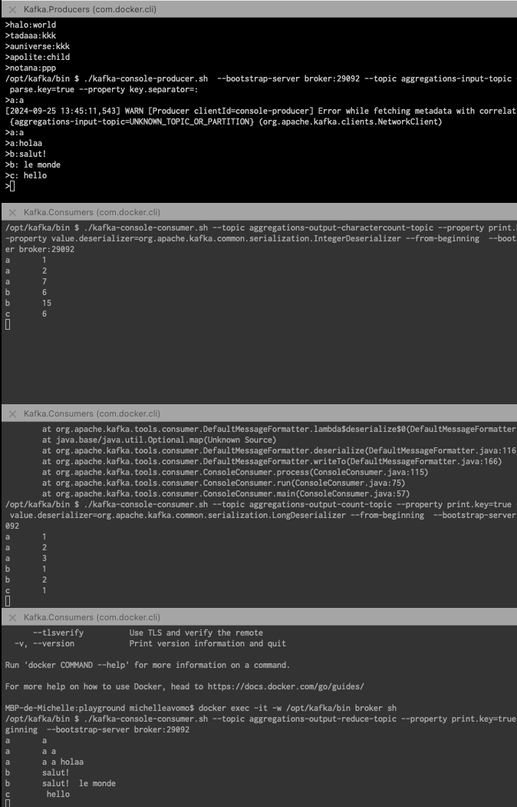
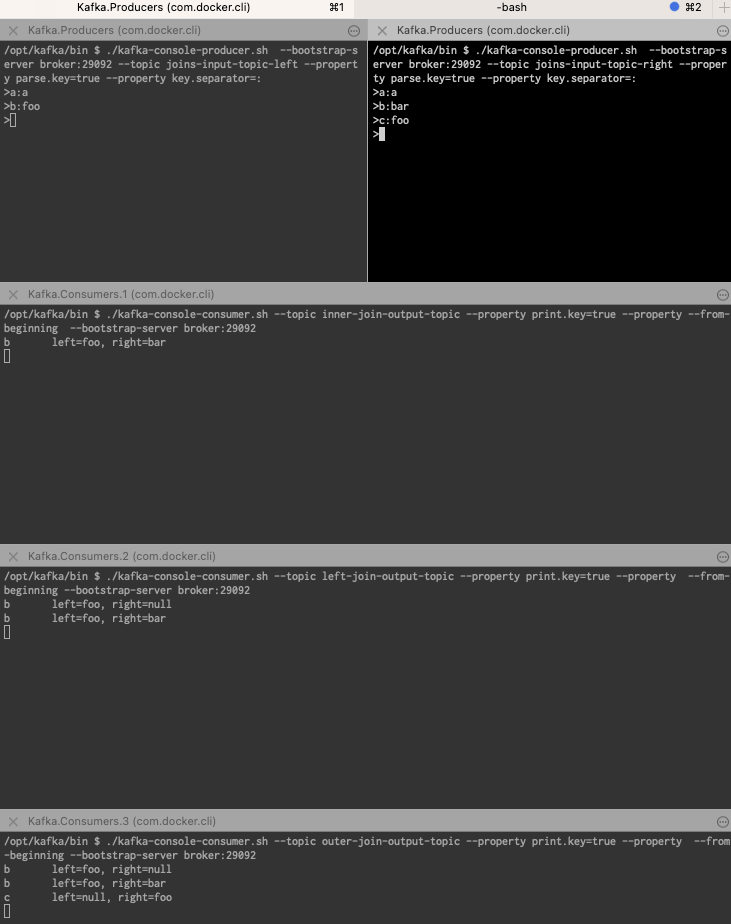

## Intro
Ce repo est clôné du repertoire de aCloudGuru (anciennement linuxacademy) et porte essentiellement sur les exercices autour de Kafka-Streams.
Ici j'ai : 
1. Mis à jour le repo pour qu'il supporte JUnit 5, Java 17 s'exécute sur Gradle 7.3
2. Rajouté un fichier `docker-compose.yml` pour permettre à chacun de s'entraîner avec un cluster local
        - Pour en savoir plus, voir [ici](https://developer.confluent.io/confluent-tutorials/kafka-on-docker/)
3. implémenter les opérations attendues dans la vidéo. 

### Démarrer 
- Lancer votre Docker Engine ou votre Daemon Docker 
- Démarrer votre container Kafka: 
    > docker exec -it -w /opt/kafka/bin broker sh

À chaque fois que vous aurez besoin de lancer kafka en ligne de commande, executez la commande ci-dessous:
    > docker exec -it -w /opt/kafka/bin broker sh

###  Manipulations des Streams  

###  1. Basic streams (StreamsMain.java)
> ./gradlew runStreams

#### a. Démarrer un producer

> ./kafka-console-producer.sh  --bootstrap-server broker:29092 --topic streams-input-topic 
> --property parse.key=true --property key.separator=:

#### b. Démarrer un consumer

> ./kafka-console-consumer.sh --topic streams-output-topic --property print.key=true --from-beginning  --b
ootstrap-server broker:29092

###  2. Transformations de streams sans états (StatelessTransformationsMain.java)
> ./gradlew runStatelessTransformations

###  3. Aggregations streams (AggregationsMain.java)

>  ./gradlew runAggregations

#### a. aggregations-output-charactercount-topic

> ./kafka-console-consumer.sh --topic aggregations-output-charactercount-topic --property print.key=true -
-property value.deserializer=org.apache.kafka.common.serialization.IntegerDeserializer --from-beginning  --bootstrap-serv
er broker:29092

#### b. aggregations-output-count-topic

> ./kafka-console-consumer.sh --topic aggregations-output-count-topic --property print.key=true --property
value.deserializer=org.apache.kafka.common.serialization.LongDeserializer --from-beginning  --bootstrap-server broker:29
092
>

#### c. aggregations-output-reduce-topic
> ./kafka-console-consumer.sh --topic aggregations-output-reduce-topic --property print.key=true --from-be
ginning  --bootstrap-server broker:29092

Résultat:

### Joining Streams 

5 kafka sessions 
2 producers
>  ./kafka-console-producer.sh  --bootstrap-server broker:29092 --topic joins-input-topic-left --property parse.key=true --property key.separator=:
>  ./kafka-console-producer.sh  --bootstrap-server broker:29092 --topic joins-input-topic-right --property parse.key=true --property key.separator=:
3 consumers

** Inner Join 
> ./kafka-console-consumer.sh --topic inner-join-output-topic --property print.key=true --property  --from-
beginning --bootstrap-server broker:29092

** Left join
>  ./kafka-console-consumer.sh --topic left-join-output-topic --property print.key=true --property  --from-
beginning --bootstrap-server broker:29092
> 

## Join session : résultats

