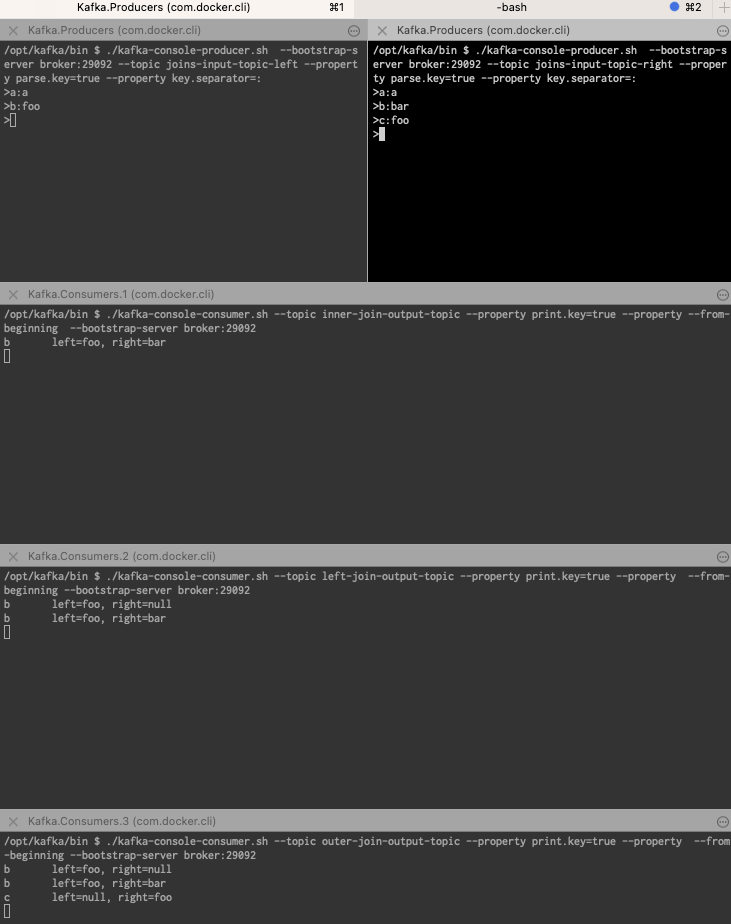

## Getting started

> docker exec -it -w /opt/kafka/bin broker sh

To get into the container and access the terminal

#### Starting a producer: 

1. Basic streams
> ./kafka-console-producer.sh  --bootstrap-server broker:29092 --topic streams-input-topic --property pars
e.key=true --property key.separator=:

#### Starting a consumer

1. Basic streams

> /kafka-console-consumer.sh --topic streams-output-topic --property print.key=true --from-beginning  --b
ootstrap-server broker:29092

3. Aggregations consumers 

>  ./gradlew runAggregations

    a. aggregations-output-charactercount-topic

> ./kafka-console-consumer.sh --topic aggregations-output-charactercount-topic --property print.key=true -
-property value.deserializer=org.apache.kafka.common.serialization.IntegerDeserializer --from-beginning  --bootstrap-serv
er broker:29092

    b. aggregations-output-count-topic
> ./kafka-console-consumer.sh --topic aggregations-output-count-topic --property print.key=true --property
value.deserializer=org.apache.kafka.common.serialization.LongDeserializer --from-beginning  --bootstrap-server broker:29
092
> 

    c. aggregations-output-reduce-topic
> ./kafka-console-consumer.sh --topic aggregations-output-reduce-topic --property print.key=true --from-be
ginning  --bootstrap-server broker:29092

Résultat:

### Joining Streams 

5 kafka sessions 
2 producers
>  ./kafka-console-producer.sh  --bootstrap-server broker:29092 --topic joins-input-topic-left --property parse.key=true --property key.separator=:
>  ./kafka-console-producer.sh  --bootstrap-server broker:29092 --topic joins-input-topic-right --property parse.key=true --property key.separator=:
3 consumers

** Inner Join 
> ./kafka-console-consumer.sh --topic inner-join-output-topic --property print.key=true --property  --from-
beginning --bootstrap-server broker:29092

** Left join
>  ./kafka-console-consumer.sh --topic left-join-output-topic --property print.key=true --property  --from-
beginning --bootstrap-server broker:29092
> 

## Join session : résultats

